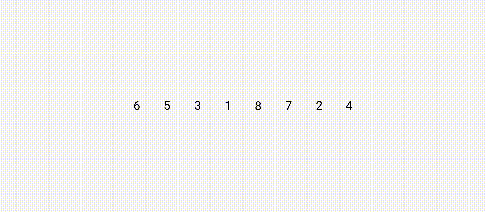

## Пузырьковая сортировка

Иногда в массиве нужно навести порядок: отсортировать и упорядочить его элементы. Для этого применяют алгоритмы сортировки.

Всего в этой теме мы разберём четыре вида сортировок и убедимся, что одну задачу можно решить разными по сложности алгоритмами. В этом уроке вы изучите первый алгоритм сортировки.

В пузырьковой сортировке (bubble sort) мы попарно сравниваем и переставляем в порядке возрастания или убывания все элементы массива. Повторяем до тех пор, пока требуются перестановки.

За один проход по массиву поднимаем наверх самое большое число. Оно всплывает как пузырик. Отсюда и название — пузырьковая сортировка.

Для массива `[6,5,3,1,8,7,2,4]` пузырьковая сортировка происходит так:

Запишем алгоритм пузырьковой сортировки, где `arr` — входной массив, `n` — его длина:

1.  Идём по массиву от `0` до `n - 1` . Текущий индекс будет `i`.
2.  Если `arr[i] > arr[i + 1]`:
    
    2.1 Меняем местами эти элементы массива.
    
    2.2 Отмечаем флагом `swapped = true`, что была совершена перестановка.
    
3.  После окончания цикла проверяем, были ли перестановки в этом проходе:
    
    3.1 Если да — сбрасываем флаг `swapped = false` и начинаем заново с пункта 1.
    
    3.2 Если нет — массив отсортирован.