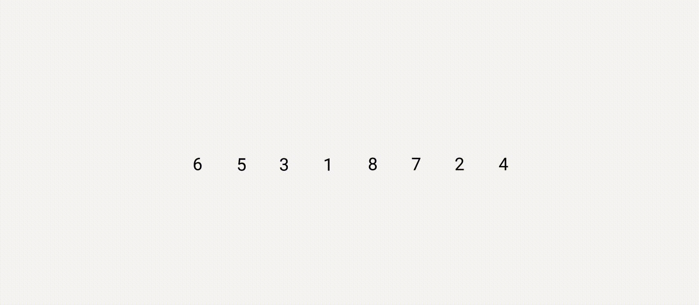

Спринт 2/12: Алгоритмы → Тема 3/9: Спринт II → Урок 3/5

## Сортировка вставками

В алгоритме сортировки вставками (insertion sort) мы разбиваем массив на две части –– отсортированную и неотсортированную. На каждом шаге берём из второй части элемент и вставляем его на своё место в отсортированную часть массива. Повторяем до тех пор, пока не отсортируем все элементы.

Для массива `[6,5,3,1,8,7,2,4]` сортировка вставками происходит так:

Запишем алгоритм сортировки вставками, где `arr` — входной массив, `n` — его длина:

1.  Идём по массиву от `1` до `n`. Текущий индекс будет `i`.
2.  Ищем индекс вставки элемента `insertionIndex`:
    
    2.1 Выставляем `insertionIndex = 0` по умолчанию.
    
    2.2 Идём по массиву от `i - 1` до `0`. Текущий индекс будет `j`.
    
    2.3 Если `arr[j] < arr[i]`, то `insertionIndex = j + 1`. Выходим из цикла.
    
3.  Сдвигаем все элементы с `insertionIndex` до `i - 1` включительно на одну позицию вперёд, а элемент с индексом `i` помещаем в `insertionIndex`.
    

### Анализ сложности

Возьмём массив длиной `n`, отсортированный наоборот. Сделаем `n-1` проходов внешнего цикла (от `1` до `n`). В каждом проходе совершим `2i+1` операций, где `i` — индекс текущего элемента.

Чтобы разместить элемент `4` с индексом `4` в массиве `[5,6,7,8,4,3,2,1]`, понадобится 4 операции сравнения. Здесь мы дойдём до начала массива. Затем выполним 4 операции сдвига элементов `5 ... 8` и вставим элемент `4` на своё место в массиве. Всего на сортировку этого элемента уйдёт 9 операций:

_Максимальное количество операций для сортировки одного элемента — `2i+1`_

Сложность внутреннего цикла получится `О(2i + 1) = О(i)`.

Теперь посчитаем суммарную сложность алгоритма в худшем случае. На первом шаге, при `i=1`, сложность вставки элемента на своё место в отсортированную часть массива `О(1)`. На втором — `О(2)`, а на n-ом шаге сложность равна `О(n)`. Общая сложность `О(1 + 2 + ... + n)`. Сумма от `1` до `n` равна `(n + 1) * n / 2`. Получается, что сложность этого алгоритма `О((n + 1) * n / 2) = О(n^2)`.

В позитивном сценарии на вход подаётся отсортированный массив. На каждом шаге мы сравниваем всего раз — текущий элемент с предыдущим, чтобы убедиться, что они стоят на своём месте. Сложность такого сценария `Ω(n)`.

В базовом случае, когда массив частично упорядочен, сделаем `n-1` шагов. На каждом шаге совершим от `1` до `2i+1` операций. Это даст линейную зависимость от `i`. Сложность базового сценария `Θ(n^2)`.

Пространственная сложность алгоритма `О(1)`, ведь размер входных данных не влияет на объём потребляемой алгоритмом памяти.