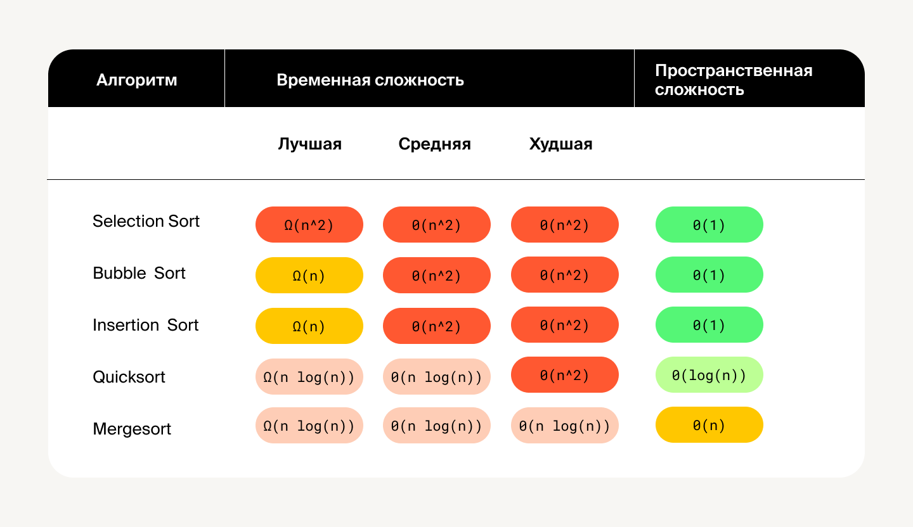

## Шпаргалка

**Пузырьковая сортировка**

Попарно сравниваем каждый элемент со следующим и переставляем их местами в порядке возрастания или убывания. Повторяем процедуру, пока требуются перестановки.

Временная сложность — `Ω(n)`, `Θ(n^2)`, `О(n^2)`. Пространственная сложность — `О(1)`.

**Сортировка вставками**

Разбиваем массив на отсортированную и неотсортированную части. Берём элемент из неотсортированной и вставляем его на своё место в отсортированную часть массива. Алгоритм работает до тех пор, пока в неотсортированной части есть элементы.

Временная сложность — `Ω(n)`, `Θ(n^2)`, `О(n^2)`. Пространственная сложность — `О(1)`.

**Быстрая сортировка**

Выделяем в массиве опорный элемент и разбиваем массив на две части: в одной числа меньше опорного элемента, в другой –– больше. Затем рекурсивно вызываем алгоритм на двух выделенных группах и соединяем левую и правую части с опорным элементом в конечный результат.

Временная сложность — `Ω(n*log(n))`, `Θ(n*log(n))`, `О(n^2)`. Пространственная сложность — `О(log(n))`.

**Сортировка слиянием**

Разбиваем массив на две равные части, сортируем каждую из них отдельно и соединяем две отсортированные части в одну.

Временная сложность — `Ω(n*log(n))`, `Θ(n*log(n))`, `O(n*log(n))`. Пространственная сложность — `О(n)`.

**Сортировка выбором**

Мы упоминали этот тип сортировки в прошлых уроках, но не останавливались на нём подробно. Суть алгоритма такая: на каждом шаге ищем самый маленький элемент и ставим его в начало массива. Временная сложность — `Ω(n^2)`, `Θ(n^2)`, `О(n^2)`. Пространственная сложность — `О(1)`.

### Сравнительная таблица алгоритмов сортировки

_Сравнительная таблица алгоритмов сортировки_