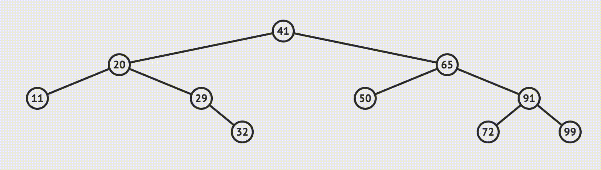
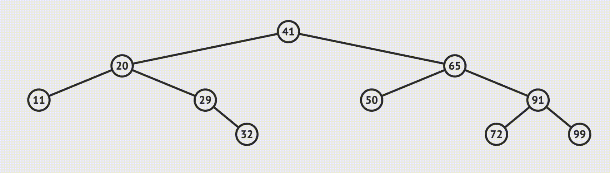
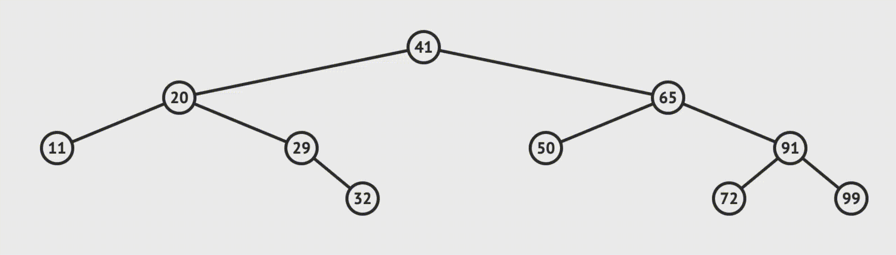
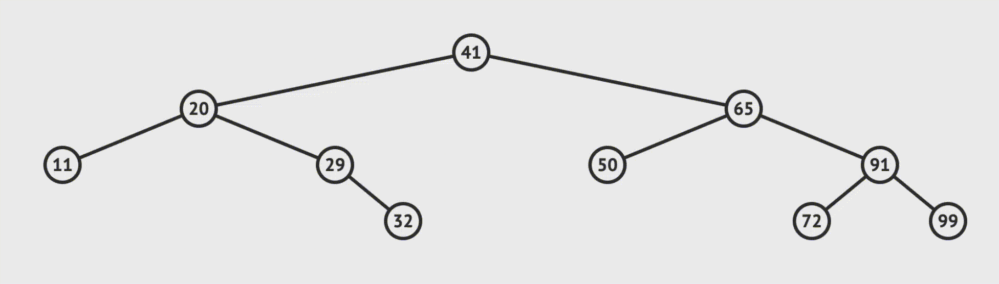
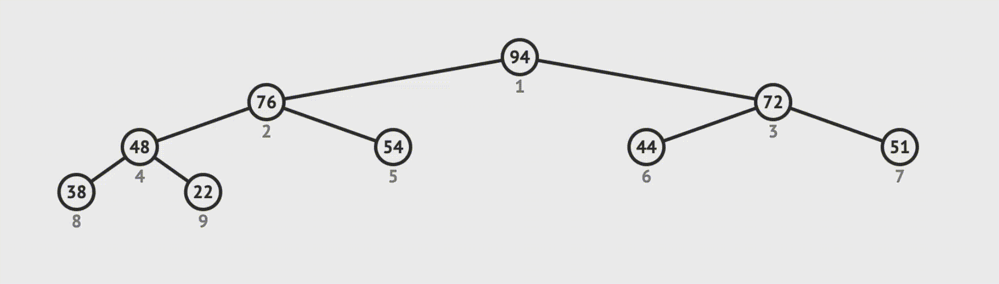
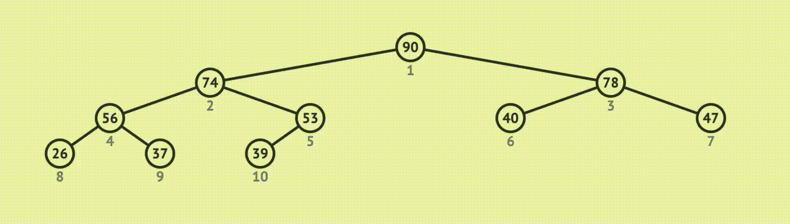

## Операции с бинарным деревом поиска и бинарной кучей
[Ссылка на урок](https://practicum.yandex.ru/learn/middle-frontend/courses/6f84acc4-7f8d-43c5-81c3-bdb693735a9a/sprints/7169/topics/9b385ae0-748d-4aae-b37f-a60cb8e6cdc1/lessons/2e87c0af-4fcf-472e-9752-ac88d3732e42/)

В прошлом уроке вы изучили два типа деревьев — бинарное дерево поиска и бинарную кучу. В этом рассмотрим операции поиска, добавления и удаления в этих структурах данных.

## Операции с бинарным деревом поиска

Чтобы найти элемент в BST, нам понадобится обойти дерево. Так как элементы со значениями меньше родителя располагаются слева, а больше — справа, потребуется обойти количество узлов, равное высоте дерева. Ведь на каждом шагу мы отсекаем часть данных.

*Поиск элемента 72 по BST*

Если дерево сбалансированно, его высота — логарифм от количества элементов. Поэтому в базовом случае поиск по дереву занимает `О(log(n))`.

В худшем случае дерево представляет связный список, где все элементы выстроены по одной стороне дерева. Чтобы отыскать нужный, придётся обойти все элементы. Сложность в худшем случае `О(n)`.

Чтобы добавить элемент в BST, также нужно сначала обойти дерево и найти лист, которому можно присвоить новую ноду. Работа со ссылками занимает `О(1)`. Поэтому сложность операции добавления элемента такая же, как при поиске — `О(log(n))`.

_Добавление элемента со значением 15 в BST_

Операция удаления элемента из BST сложнее, ведь после неё нужно сохранить свойства BST, чтобы структура данных не перестала быть бинарным деревом поиска.

Удалить элемент из BST можно тремя способами:

1.  Если у ноды нет детей, удаляем её, обнуляя ссылку на неё у родителя.

_Удаление ноды без детей из BST_

2.  Если у ноды только один ребёнок, меняем ссылку у родителя ноды на её ребёнка. Ссылки ноды ставим в `null`.

_Удаление ноды с одним ребёнком из BST_

3.  Если у ноды два ребёнка, удаляемый элемент заменяют самым большим элементом из левой части дерева либо самым маленьким из его правой части.

На схеме мы решаем удалить ноду 10.

_Нахождение самого большого элемента в левой части и самого маленького в правой._

Пути до двух подходящих для замены элементов при удалении ноды `10` выделены на изображении синим.

В левой части дерева самый большой элемент лежит по правому пути, начиная с левого ребёнка. В правой части дерева самый маленький элемент лежит по левому пути, начиная с правого ребёнка.

После удаления дерево принимает один из двух вариантов:

_Дерево после удаление элемента, в зависимости от выбранного элемента на замену._

Если у левого ребёнка нет детей справа или у правого нет детей слева, сами дети используются в качестве замены:

_Дети могут также использоваться для замены._

Рекомендуем чередовать оба варианта замены при удалении элементов из дерева. Это поможет ему оставаться в сбалансированном состоянии.

Когда дерево несбалансированно, оно становится менее эффективным. Чтобы привести его в сбалансированную форму, запускают операцию балансировки. Эта операция пересортирует элементы и обеспечит минимально возможную высоту дерева.

Таким образом, чтобы удалить элемент, нужно сначала его найти. Сложность этой операции `О(log(n))`. Затем ищут замену удаляемому элементу, что также занимает `О(log(n))`. В конце нужно поменять эти элементы местами за `О(1)`. Суммарная сложность удаления элемента из BST — `O(log(n))+O(log(n))+(1) = O(log(n))`. В худшем случае, когда дерево представляет связный список, операция удаления занимает `О(n)`.

Пространственная сложность бинарного дерева поиска — `О(n)`. Объём памяти, нужный для реализации BST, растёт линейно по отношению к количеству данных.

## Операции с бинарной кучей

В этой структуре данных элементы добавляют всегда в конец. При реализации бинарной кучи через массив новые элементы записывают в конец массива. Затем нужно убедиться, что свойство бинарной кучи не нарушено. Для этого сравнивают новый элемент с родителем. Если родитель больше, элемент остаётся на месте и вставка закончена. Если родитель меньше, элементы в бинарной куче меняются местами до тех пор, пока родитель не окажется больше или пока новый элемент не достигнет вершины. Эта операция называется `bubbleUp` — элемент всплывает на своё место снизу вверх. В худшем случае элемент поднимется на вершину бинарной кучи, давая сложность `О(log(n))`.

_Добавление элемента в бинарную кучу в худшем случае_

Базовый случай сложнее. Примерно половина кучи состоит из листьев, то есть нод без детей. В такой бинарной куче элементы расположены по убыванию. Предположим, что листья в ней — самые маленькие элементы в куче. Тогда вероятность того, что новым элементом станет лист, расположенный в самом нижнем уровне, равна `0.5`.

Вероятность того, что новый элемент окажется выше также `0.5`. Внутри оставшейся части дерева действуют те же правила. Поэтому вероятность того, что лист останется на предпоследнем уровне — `0.5 * 0.5 = 0.25`. А вероятность, что он попадёт на третий с конца уровень — `0.5 * 0.5* 0.5 = 0.125`.

Тогда, чтобы разместить элемент, нужно проверить ожидаемое число уровней — `10.5 + 20.25 + 30.125 + ... + n0.5^n = 2`. Это число немного занижено, ведь вероятность, что элемент окажется на нижнем уровне чуть меньше `0.5`. На самом деле оно равно `2.6`. Тем не менее в базовом случае сложность добавления элемента константная — `О(1)`.

Есть другое объяснение, которое легче запомнить: на последних трёх уровнях бинарной кучи расположено экспоненциально больше элементов, чем в остальной её части. Поэтому вероятность того, что элемент расположится там, высокая. Значит, в большинстве случаев потребуется максимум три операции, чтобы элемент занял своё место. А это говорит о константной сложности.

Удаляют элемент из бинарной кучи обычно с вершины. При удалении вершины получаются две бинарные кучи, расположенные слева и справа от вершины. Чтобы их объединить, помещают самый последний элемент в вершину. Затем новую вершину сравнивают с детьми. Если один из детей больше вершины, меняют их местами. Если оба ребёнка больше вершины, выбирают максимального и меняют его местами с вершиной.

Продолжают до тех пор, пока дети не станут меньше родителей. Эта операция называется `sinkDown` — элемент опускается сверху вниз на своё место. Количество операций зависит от высоты дерева, поэтому сложность удаления элемента из кучи — `O(log(n))`.

_Удаление вершины из бинарной кучи_

Удаление произвольного элемента происходит по такому же алгоритму.

Операция поиска в бинарной куче занимает `О(n)`. Если реализовать бинарную кучу через массив, получится просто линейный поиск по нему.

Пространственная сложность бинарной кучи — `О(n)`.

Бинарное дерево поиска и бинарная куча — два часто используемых типа деревьев.

Бинарные деревья поиска применяют для обеспечения быстрого поиска элементов при относительно недорогой стоимости добавления новых элементов.

Бинарная куча позволяет быстро как добавлять элементы, так получать доступ к корневому элементу и удалять его с сохранением структуры кучи. Бинарную кучу используют для реализации других структур данных, например очереди с приоритетом. Отличие обычной очереди от очереди с приоритетом в том, что в ней получают не просто последний добавленный элемент, а элемент с самым высоким приоритетом. Именно такая структура данных помогает операционной системе предоставлять процессорное время программам в зависимости от их приоритетности.