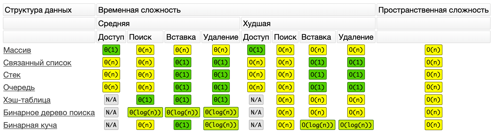
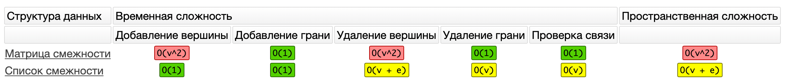

## Структуры данных: повторение

[Ссылка на урок](https://practicum.yandex.ru/trainer/middle-frontend/lesson/7cd74009-bc29-4fe3-b12d-637136bc971c/)

Вы изучили восемь структур данных. Вспомните их основные характеристики и ответьте на вопросы.

Какие структуры данных поддерживают обращение к элементу по индексу?

Правильный ответ

Верно. Массив поддерживает эту операцию за константное время.

Тоже правильный ответ

Верно. Хоть это и требует линейный проход по элементам.

Тоже правильный ответ

Да, стек поддерживает эту операцию, как и связный список.

Тоже правильный ответ

Да, в очереди тоже можно обращаться к элементу по индексу.

Неправильный ответ

Нет, хэш-таблицы поддерживают доступ к элементам по ключу.

Нет, деревья не поддерживают доступ к ноде по индексу.

В памяти бинарная куча хранится как массив, но это только способ её реализации. Бинарная куча не поддерживает доступ к элементу по индексу.

Неправильный ответ

Несмотря на то, что граф можно реализовать массивом, он не поддерживает доступ к элементу по индексу.

Выберите структуру данных, которая поддерживает быстрое добавление и удаление минимального элемента.

Неправильный ответ

Неверно. Массив не упорядочен, поэтому операция удаления наименьшего элемента имеет линейную сложность.

Неправильный ответ

Нет. Список не упорядочен. Операция удаления минимального элемента требует линейного прохода.

Неправильный ответ

Стек не подойдёт. Чтобы найти в нём минимум, нужно в худшем случае перебрать весь стек.

Неправильный ответ

Неверно. Чтобы удалить наименьший элемент из очереди, придётся перебрать её всю.

Нет. Хэш-таблица не бывает сортированной. Чтобы найти удаляемый элемент в хэш-таблице, придётся перебрать все ключи.

Неверно. Чтобы удалить минимальный элемент из бинарного дерева поиска, его нужно сначала найти, что в худшем случае имеет линейную сложность. Затем удалить.

Правильный ответ

Верно. В бинарную кучу добавляют элемент за Θ(1), а удаляют за Θ(log(n)). В худшем случае обе операции займут O(log(n)).

Нет. Чтобы удалить наименьший элемент из графа, его нужно сначала найти за О(n).

Какая структура данных позволяет искать, добавлять и удалять элементы за `Θ(1)`?

Неверно. Массив обеспечивает только доступ к элементу по индексу за `Θ(1)`.

Неверно. Связный список умеет только добавлять и удалять элементы за `Θ(1)`.

Неверно. Стек умеет только добавлять и удалять элементы за `Θ(1)`.

Неверно. Очередь умеет только добавлять и удалять элементы за `Θ(1)`.

Правильный ответ

Верно, хэш-таблица поддерживает все эти операции за `Θ(1)`, в худшем случае — за `O(n)`.

Неверно. Бинарное дерево поиска ни одну операцию не выполняет за `Θ(1)`.

Неверно. Бинарная куча умеет только добавлять элементы за `Θ(1)`.

Неверно. Ни одна из реализаций графа этого не позволяет.

Вам нужно где-то хранить и обрабатывать заявки в порядке их поступления. Какая структура данных подойдёт больше всех?

Неверно. Массив можно использовать, но очередь подойдёт больше.

Неверно. Список можно использовать, но очередь подойдёт больше.

Неверно. Если только вы не хотите обслуживать заявки в обратном порядке.

Правильный ответ

Верно. Очередь отлично подойдёт.

Неверно, хэш-таблица не подойдёт.

Неверно. Бинарное дерево не подойдёт.

Неверно. Бинарная куча не подойдёт.

Неверно. Графы не подойдут.

Какая структура данных позволяет искать, добавлять и удалять элементы за `Θ(log(n))`?

Неверно. Все эти операции по массиву занимают линейное время.

Неверно. Поиск по списку занимает линейное время, а добавление и удаление — константное.

Неверно. Поиск по стеку занимает линейное время, а добавление и удаление — константное.

Неверно. Поиск по очереди занимает линейное время, а добавление и удаление — константное.

Неверно. В хэш-таблице эти операции занимают `Θ(1)`.

Правильный ответ

Верно. Если дело касается логарифмов, это наверняка бинарное дерево.

Неверно. Поиск по бинарной куче всегда линеен.

Неверно. Сложность добавления и удаления вершин и рёбер в графе зависит от реализации. В лучшем случае добавить вершины можно за константное время, а удалить за линейное. Неверно. Графы не подойдут.

Вам нужно хранить информацию о клиентах и быстро её искать по введённому имени за константное время. Какой структурой данных воспользуетесь?

Неверно. Массив не подойдёт. Чтобы найти клиента по имени, придётся производить поиск по элементам.

Неверно. Список –– структура данных с последовательным доступом к элементам. Чтобы найти нужного пользователя, мы переберём всех до него. Этот поиск имеет линейную сложность.

Неверно. Чтобы найти нужного пользователя, нам придётся в худшем случае вытащить из стека всех до него. Эта операция имеет линейную сложность.

Неверно. Чтобы найти нужного пользователя, нам придётся в худшем случае вытащить из очереди всех до него. Эта операция имеет линейную сложность.

Правильный ответ

Верно. Ключами хэш-таблицы могут быть имена пользователей. Операция получения данных по ключу из хэш-таблицы имеет константную сложность.

Неверно. В худшем случае нам придётся обойти все узлы дерева.

Неверно. Операция поиска элемента в бинарной куче имеет логарифмическую сложность. А по условию задачи нужно найти структуру данных, в которой поиск происходит за константное время.

Неверно. Чтобы найти пользователя в графе, придётся в худшем случае обойти все его вершины. Сложность этой операции `O(n)`.

Вам нужно собрать статистику контактов внутри большой группы людей: кто с кем знаком. Какой структурой данных воспользуетесь?

Неверно. Массив не подойдёт. Он позволяет хранить элементы, но не связи между ними.

Неверно. Список не подойдёт. Он позволяет хранить элементы, но не связи между ними.

Неверно. Стек не подойдёт. Он позволяет хранить элементы, но не связи между ними.

Неверно. Очередь не подойдёт. Она позволяет хранить элементы, но не связи между ними.

Неверно, хэш-таблица не подойдёт. Она позволяет хранить элементы, но не связи между ними.

Неверно. Бинарное дерево не подойдёт. Оно позволяет хранить элементы, но не связи между ними

Неверно. Бинарная куча не подойдёт. Она позволяет хранить элементы, но не связи между ними.

Правильный ответ

Верно. Графы для этого идеально подойдут, ведь они хранят не только набор элементов, но и связи между ними.

Какие структуры данных требуют выделения непрерывной области памяти?

Тоже правильный ответ

Верно, массив предполагает выделение непрерывной области памяти.

Неверно. Для связанного списка память выделяется динамически по мере добавления элементов.

Неверно. Для стека память выделяется динамически по мере добавления элементов.

Неверно. Для очереди память выделяется динамически по мере добавления элементов.

Тоже правильный ответ

Верно. Хэш-таблица, как и массив, хранится в одном блоке памяти.

Неверно. Элементы дерева могут быть разбросаны по памяти, так как они связаны ссылками.

Тоже правильный ответ

Верно. Бинарная куча хранится в памяти как массив.

Неправильный ответ

Неверно. Элементы графа могут быть разбросаны по памяти, так как они связаны ссылками.

## Шпаргалка

**Массив**

Хранит данные в непрерывном блоке памяти последовательно, обеспечивая быстрый доступ к любому элементу по индексу за Θ(1). Остальные операции требуют линейного времени Θ(n).

**Связный список**

Хранит данные последовательно, связывая их ссылками, поэтому не требует выделения непрерывного блока памяти. Обеспечивает быстрое добавление новых элементов в начало и конец списка за Θ(1). Остальные операции занимают линейное время Θ(n).

**Стек и очередь**

Базируются на связном списке, поэтому обладают теми же характеристикам. Но добавляют и удаляют элементы из стека и очереди в определённом порядке. Стек реализует принцип LIFO — последний добавленный элемент будет удалён первым. Очередь реализует принцип FIFO — первый добавленный элемент будет удалён первым.

**Хэш-таблица**

Хранит пары ключ-значение. Хэш-функция переводит ключ в число. Позволяет быстро добавлять, удалять и искать элементы по ключу за Θ(1).

**Бинарное дерево поиска**

Бинарное дерево, где значения потомков слева меньше родителя, а значения потомков справа больше родителя. За счёт этого свойства обеспечивается достаточно быстрое добавление, удаление и поиск элементов за Θ(log(n)).

**Бинарная куча**

Бинарное дерево, в котором все потомки меньше либо больше родителя. Обеспечивает очень быстрое добавление элементов за Θ(1) и достаточно быстрое удаление корневого (самого большого) элемента за Θ(log(n)).

**Граф**

Хранит любые сущности и связи между ними. Реализуется двумя способами: матрицей смежности и списком смежности. Матрица смежности позволяет быстро добавлять и удалять рёбра, а также проверять наличие связи за `O(1)`, но требует много памяти — `О(v^2)`. Операция добавления и удаления вершины также занимает `O(v^2)`. Список смежности позволяет быстро добавлять вершины и рёбра за `O(1)`. Остальные операции выполняются за линейное время. Пространственная сложность списка смежности — `О(v + e)`, ведь мы храним список всех вершин и рёбер.

